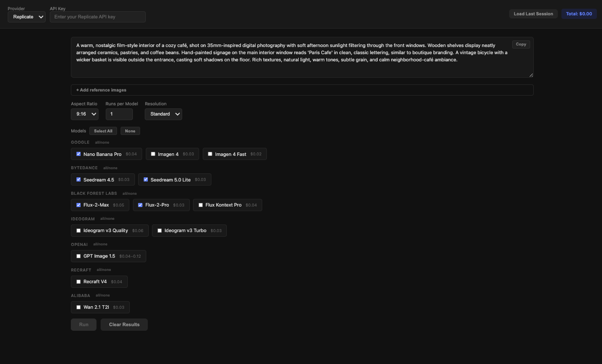

# Image Gen Evaluator

A local tool for comparing image generation models side-by-side. Enter a prompt, select models, and see results as they stream in -- with generation time and cost estimates for each.

All API calls are made server-side. API keys are held in memory only and never persisted.



# Why?
While building https://www.twinklebot.app/ I found out the hard way that you can either have good model performance (from the model maker) or good scaling (from the provider) but not both (apparently -- but feel free to change my mind!). For example, google nanobanana-pro offers amazing character consistency, editing and styling but none of the providers (replicate, fal.ai or even google AI studio) are able to offer the service without rate limits and timeouts. Meanwhile, all the 3rd party providers offer amazing service for the open source models (like SDXL2) but they suck at editing. I'm trying to build a tool that finds out the best tradeoff betwen the two things

## Quick Start

```bash
npm install
node server.js
```

Open [http://localhost:3000](http://localhost:3000).

To use a custom port:

```bash
PORT=8080 node server.js
```

## How It Works

1. Select a provider (Replicate or xAI) and enter your API key
2. Write a text prompt (a default test prompt is pre-filled)
3. Select which models to run
4. Optionally attach reference images for models that support image editing
5. Hit **Run** -- all selected models fire in parallel
6. Results stream in via SSE as each model completes, displayed as cards with the image, model name, generation time, and price estimate
7. Click any image to open a full-screen lightbox with download

## Configuration Options

| Option | Description | Default |
|---|---|---|
| **Provider** | API provider (Replicate or xAI) | Replicate |
| **API Key** | Replicate or xAI API token (required) | -- |
| **Prompt** | Text description of the image to generate | Pre-filled test prompt |
| **Aspect Ratio** | Output image aspect ratio | 9:16 |
| **Resolution** | Standard or high quality | Standard |
| **Runs per Model** | Number of times to run each selected model (1-5) | 1 |
| **Reference Images** | Upload images for editing/reference (supported models only) | None |

## Supported Models

### Replicate Provider

#### Text-to-Image Only

| Model | Replicate ID | Provider | Est. Cost | Notes |
|---|---|---|---|---|
| Imagen 4 | `google/imagen-4` | Google | $0.03 | |
| Imagen 4 Fast | `google/imagen-4-fast` | Google | $0.02 | |
| Ideogram v3 Quality | `ideogram-ai/ideogram-v3-quality` | Ideogram | $0.06 | Inpainting only (requires mask, not supported in UI) |
| Ideogram v3 Turbo | `ideogram-ai/ideogram-v3-turbo` | Ideogram | $0.03 | Inpainting only (requires mask, not supported in UI) |
| Recraft V4 | `recraft-ai/recraft-v4` | Recraft | $0.04 | |
| Wan 2.1 T2I | `alibaba/wan-2.1-t2i` | Alibaba | $0.03 | |

#### Text-to-Image + Image Editing

These models accept reference/input images when provided. The API parameter name varies per model.

| Model | Replicate ID | Provider | Est. Cost | Image Param | Format | Max Images |
|---|---|---|---|---|---|---|
| Nano Banana Pro | `google/nano-banana-pro` | Google | $0.04 | `image_input` | Array of URIs | 14 |
| Seedream 4.5 | `bytedance/seedream-4.5` | ByteDance | $0.03 | `image_input` | Array of URIs | 14 |
| Seedream 5.0 Lite | `bytedance/seedream-5-lite` | ByteDance | $0.03 | `image_input` | Array of URIs | -- |
| Flux-2-Max | `black-forest-labs/flux-2-max` | Black Forest Labs | $0.05 | `input_images` | Array of URIs | 8 |
| Flux-2-Pro | `black-forest-labs/flux-2-pro` | Black Forest Labs | $0.03 | `input_images` | Array of URIs | 8 |
| Flux Kontext Pro | `black-forest-labs/flux-kontext-pro` | Black Forest Labs | $0.04 | `input_image` | Single URI | 1 |
| GPT Image 1.5 | `openai/gpt-image-1.5` | OpenAI | $0.04-0.12 | `input_images` | Array of URIs | -- |

> GPT Image 1.5 requires a separate OpenAI API key entered in the UI.

### xAI Provider

These models use the xAI API directly (not Replicate) and require an xAI API key.

| Model | Model ID | Est. Cost | Image Editing |
|---|---|---|---|
| Grok Imagine | `grok-imagine-image` | $0.02 | Yes (up to 5 images) |
| Grok Imagine Pro | `grok-imagine-image-pro` | $0.07 | Yes (up to 5 images) |

xAI image editing uses the `/v1/images/edits` endpoint. Single images are sent as `image: { url }`, multiple images as `images: [{ url }, ...]`.

### Aspect Ratio Mapping

Most models accept standard aspect ratios directly. OpenAI's GPT Image 1.5 has limited ratio support, so the app maps automatically:

| Selected | Sent to GPT Image 1.5 |
|---|---|
| 9:16 | 2:3 |
| 16:9 | 3:2 |
| 1:1 | 1:1 |
| 3:4 | 2:3 |

## Tech Stack

- **Backend:** Node.js + Express
- **Frontend:** Single HTML file, vanilla JS, no build step
- **Dependencies:** `express`, `replicate`

## Project Structure

```
image-gen-evaluator/
├── server.js          # Express server, API endpoints, model config
├── public/
│   └── index.html     # Frontend (HTML + CSS + JS)
└── package.json
```

## Adding a New Model

Add an entry to the `MODELS` array in `server.js`:

```js
{
  id: "owner/model-name",        // Replicate model ID (or "xai/model-name" for xAI)
  label: "Display Name",         // Shown in the UI
  provider: "Provider Name",     // Grouping label
  priceEst: "$0.03",             // Approximate cost per generation
  supportsImages: true,          // Optional: set if model accepts image inputs
  imageParam: "input_images",    // Optional: API parameter name for images
  singleImage: true,             // Optional: true if model takes a single URI, not an array
  requiresSeparateKey: true,     // Optional: true if model needs its own API key
  apiProvider: "xai",            // Optional: "xai" for direct API (not Replicate)
}
```

If the model needs aspect ratio translation, add a mapping to `ASPECT_RATIO_MAP`.
